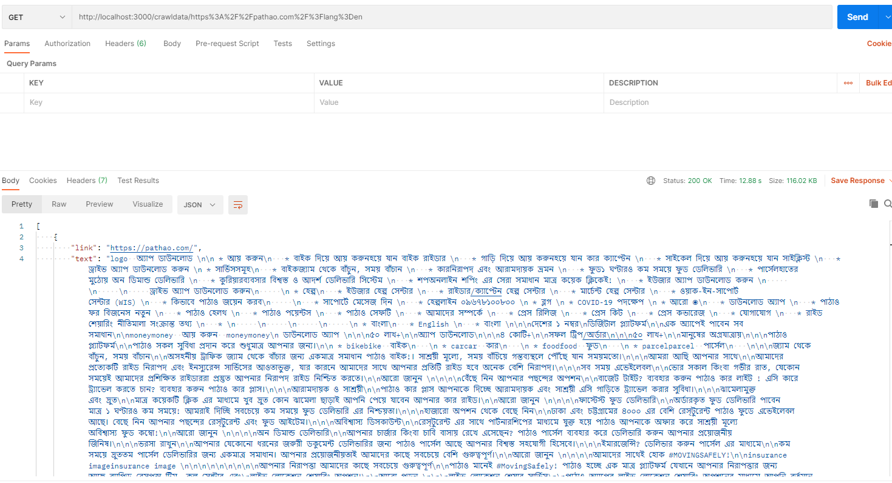
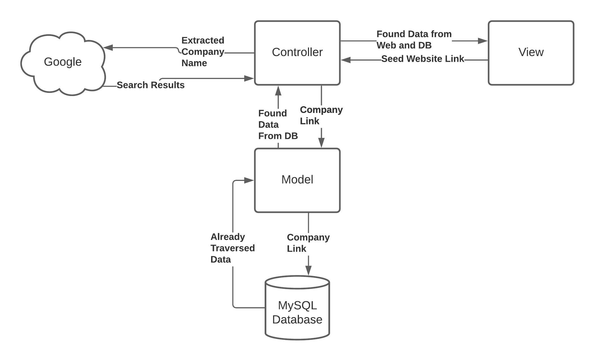
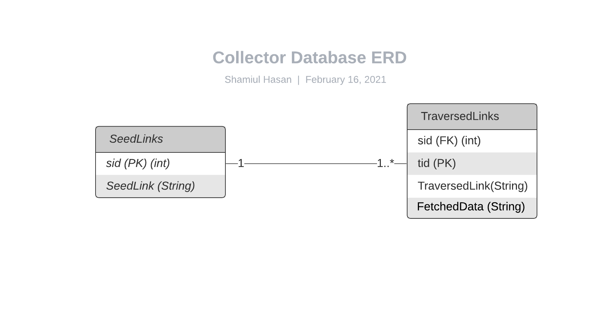
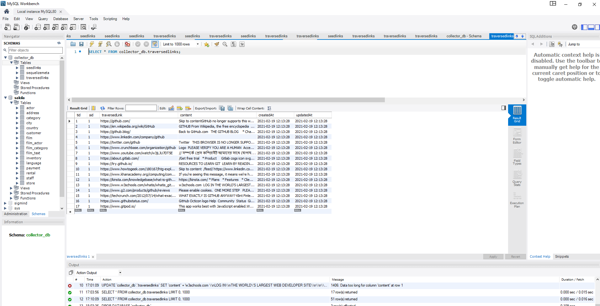

# Collector_Backend_ExpressJS
### Language & Frameworks
```
1. Node JS v14.15.5
2. Express JS v4.16.1
3. npm v6.14.11
4. MySQL
```

### Prerequisites
1. Node JS installed
2. MySQL installed

### How To Run
1. At first, create a schema named `"collector_db"` in MySQL
2. Download the repository or clone it by this command - 
```
git clone git@bitbucket.org:shamiul94/collector_backend_expressjs
```
3. You will need to change some values in `config/config.json`. You only need to change the values of `"development"` field in that file as follows - 
```
"development": {
    "username": "shamiul", // here will be your database user id
    "password": "1234", // here will go database user password
    "database": "collector_db", // name of the schema we just created 
    "host": "127.0.0.1", // will remain unchanged
    "dialect": "mysql" // will remain unchanged
}
```
4. Then run these commands from terminal.
```
cd Collector_Backend_ExpressJS
npm install
sequelize db:migrate
npm start
```
5. The server now should be listening on `3000` port. 
6. Open `Postman` and make a get request on port 3000 at the API endpoint `crawldata`. For example, 
```
http://localhost:3000/crawldata/https%3A%2F%2Fpathao.com%2F%3Flang%3Den
``` 
Here, the `http://localhost:3000/crawldata/` part comes from the API. 
The `https%3A%2F%2Fpathao.com%2F%3Flang%3Den` is the encoded version of the given url `https://pathao.com/?lang=en`. This conversion can be done using `encodeURI()` function in `javascript`. From Postman, one must input this value like this. Otherwise, it will create an error. You can convert it [here](https://www.w3schools.com/jsref/jsref_encodeuri.asp)

7. This is a screenshot of the Postman. 
8. You can also run my VueJS site and see a demo from there. 



### My Idea
#### System Flowchart 


1. I have parsed the company name from the given URL and searched it on Google through `controllers/scraperController.js`. 
2. When the response comes back from `Google.com`, this response can be parsed to extract the result links which would give us the most popular, most common publicly available data of that company. 
3. As I have seen, first 2 pages of Google search are pretty match enough to know about a company. So, I am just taking 2 pages of Google search. 
4. Parse the text from all the htmls found from these links, save them in database and return them as json response through the API. 


### Possible Further Improvement
```
1. As we have publicly available data on the internet in our database, this can be feed to a NLP model and necessary data can be parsed. By using sentiment analysis, we can decide how the public is reacting to their products. 

2. We can extract data or summarize their public appearance by using NMT models too. 

3. As Google blocks searching after a while temporarily, it would be a real challenge to keep it continuous. One solution might be to use `Torr Servie` to change IP address frequently so that Google can't identify us. But it also would be time consuming. Best option would be to buy Google API package. 

4. Scalability and distributed systems are necessary. We could part the database in multiple regions to reduce load on single server. 
```

### Database Schema

1. `SeedLinks` table will contain all the seed links given by the users as input to the API. 
2. `TraversedLinks` table will contain all the traversed data and their links from the web for all the previous seed links. 
3. When a user requests with a new seed link, we can just look into the `SeedLinks` table and take the `sid` to search in `TraverseLinks` table to find out all the traversed data from web. 
4. Here is a screenshot of the `TraversedLink` table after calling the api.




### Challenges
1. Google blocks the searching temporarily as it finds our requests to be suspicious as robot. But this ban is lifted after a little while, so it's not as much of a problem after all. 
2. I tried to use Google Search API to solve this problem but it also has a strict usage limit. Between these 2 options, searching manually seemed to be the better option. 
3. URL must be encoded before it is passed to the API because the url contains '//' in them and api gets confused about them. You have to use `encodeURI()` function before passing url as parameter to the API

### Note
1. I couldn't implement it on AWS and Docker. 
